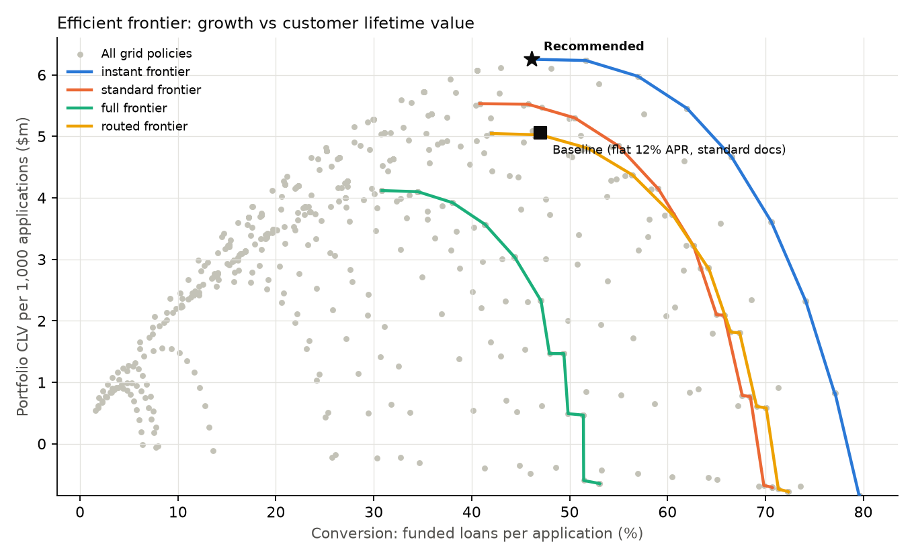

# New-customer lending strategy: recommendation memo

**Question.** What combination of documents collected, approval cutoff and pricing maximises customer lifetime value (CLV) per application? How confident can we be?

**Data.** 398,741 US SBA 7(a) small-business loans of $500k or less, approved FY2010–18 (public FOIA file, as of 30 Jun 2026). PD models were trained on FY2010–16 and every number below is evaluated out of time on FY2017–18. Figures are per 1,000 applications, in USD. Bands are P10–P90 from 300 Monte Carlo draws.

## Recommendation

| | Baseline | Recommended |
|---|---|---|
| Information before decision | Standard (form + company checks) | **Instant (form only)** |
| Pricing | Flat 12% APR | **Risk-based: cost of funds + 8pp + expected loss, capped at 25%** |
| Approval cutoff | PD ≤ 3% over term | **No PD cutoff beyond eligibility; let price absorb risk** |
| Conversion | 47.0% (42.5–51.8) | 46.1% (38.3–55.1) |
| Loss rate on funded | 1.32% | 1.49% (1.2–1.8) |
| Avg APR | 12.0% | 14.3% |
| CLV per 1k applications | $5.06m (4.54–5.62) | **$6.25m (5.17–7.62)** |

**Uplift: +$1.23m CLV per 1,000 applications (P10 +$0.41m, P90 +$2.11m). 97% of draws favour the change.**

Where the uplift comes from, in order:

1. **Dropping the extra checks: +$0.75m.** Conversion rises from 47% to 54%. Company checks barely improve ranking (AUC 0.642 → 0.647), so the extra drop-off buys almost nothing.
2. **Risk-based pricing: +$0.31m.** Riskier applicants pay for their risk instead of being declined or cross-subsidised.
3. **Removing the hard cutoff: +$0.13m.** With pricing that covers expected loss, almost every declined loan in this population was profitable.

## Why: first principles

- **Friction costs more than inaccuracy.** The full-document tier has the best model (AUC 0.70 vs 0.64). It only beats instant if the documents step keeps **≥91%** of applicants, versus 90% for instant, i.e. if it is essentially frictionless. Even with zero drop-off, the extra accuracy is worth only about 0.5% of CLV. Routing more applicants to documents lowers CLV at every threshold tested (8% routed: $6.21m; 59% routed: $5.30m).
- **Accuracy is cheap to waste and dear to buy.** Better ranking pays only where the decision changes: at the price cap, or at a binding cutoff. With risk-based pricing, that is a thin slice of applicants.
- **The cutoff becomes the lever under stress.** At 1–2× observed default rates the CLV-optimal policy has no PD cutoff. At **3×**, a 3% cutoff becomes optimal: it declines about 8% and the margin rises to 9pp. A non-bank online funnel is likely riskier than bank-screened SBA borrowers, so in practice the cutoff should be set by stress-testing, not by the base case.

## What I'm not confident about

1. **Price sensitivity sets the price, and this data can't measure it.** The observed take-up regression gives a *positive* price coefficient, because lenders price on risk, so it isn't causal. Across plausible sensitivities (−0.1 to −0.6 logit per pp), the CLV-optimal margin ranges from **14pp down to 5pp**. That is the biggest open question in the model.
2. **The PD models under-predict on newer vintages by about 20%.** They are worst at the risky end (actual/expected 1.19–1.24). Risk-based prices built on them are too low for the riskiest borrowers until they are recalibrated.
3. **Truncated population.** Every loan here was already approved by a bank. No rejected applicants are observed, so the value of screening is understated (a reject-inference problem).
4. **Leakage caught and removed.** `TermInMonths` is overwritten when a loan is restructured: 91% of charge-offs carry non-standard terms. Using it gave a fake AUC of 0.95.
5. **Assumed, not measured:** step completion rates, base take-up and repeat-borrowing propensity. Each is a slider in the simulator, and the recommendation holds while instant completion exceeds full-docs completion by more than about 1pp.

## Next steps: experiments, in priority order

1. **Randomised price test.** Apply ±1.5pp APR within each risk grade. With 46% conversion and a 3pp effect, about 4,300 applications per arm are needed. This pins down the parameter the margin depends on.
2. **Documents-step A/B.** Make the current checks optional for a random 50%. To detect 2pp of conversion, about 9,800 applications per arm are needed. Only 1% of eventual charge-offs are visible at 12 months and 13% at 24 months, so the risk guardrail should be **model-predicted expected loss of the funded mix** plus early arrears (30+ days past due), not realised losses.
3. **Permanent 2–5% random holdout** on approve/price decisions, so future PD models can learn from loans the policy would otherwise have declined.
4. **Quarterly vintage recalibration** of the PD model, with a pricing buffer equal to the latest actual/expected gap until recalibration ships.

*Simulator: `streamlit run app.py`. Every lever and assumption above can be changed there, with uncertainty bands.*
